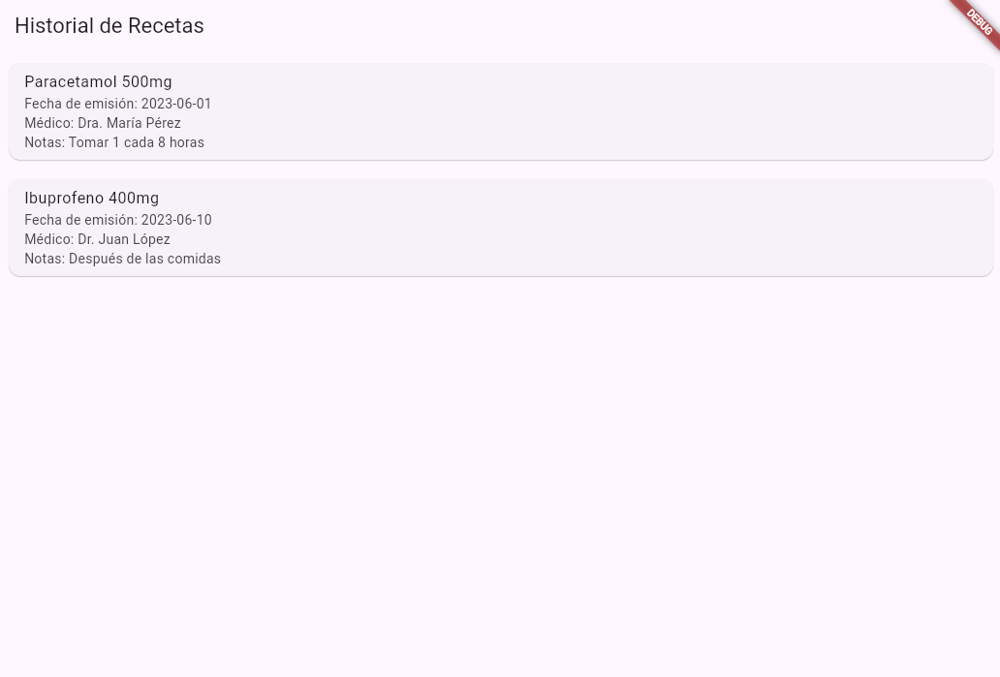

# 🩺 Historial de Recetas Médicas

Aplicación Flutter que permite a los usuarios consultar de forma sencilla y rápida su historial de recetas médicas. Diseñada con una interfaz amigable y adaptable a dispositivos móviles y web. Este proyecto fue desarrollado como parte de un desafío técnico para postular a **Agucare**.

---

## 📱 Capturas

| Pantalla de inicio | Pantalla de login | Historial de recetas |
|--------------------|-------------------|-----------------------|
|  |  |  |

---

## ✨ Funcionalidades

- Pantalla de bienvenida con branding personalizado.
- Autenticación simple con email y contraseña.
- Visualización del historial de recetas (simulado desde un servicio).
- Diseño limpio y responsive.
- Botón de recarga manual (pull to refresh).
- Manejo de errores con `SnackBar`.

---

## 🛠️ Tecnologías utilizadas

- **Flutter** 3.10.5
- **Dart**
- `FutureBuilder` para manejar llamadas simuladas tipo API
- Patrón `StatefulWidget` y navegación con `Navigator`
- Gestión de datos simulada mediante servicios locales

---

## 🧩 Requisitos previos

Antes de comenzar, asegúrate de tener instalado lo siguiente:

1. [Flutter SDK](https://docs.flutter.dev/get-started/install)
2. [Git](https://git-scm.com/)
3. [VS Code](https://code.visualstudio.com/) o Android Studio (opcional)
4. Un emulador Android/iOS o conexión a un dispositivo físico
5. Acceso a una terminal (CMD, PowerShell o Terminal)

---

## 🚀 ¿Cómo correr el proyecto?

1. **Clona el repositorio:**
   ```bash
   git clone https://github.com/Magdasanhueza/historial_recetas.git
   cd historial_recetas

2. **Instala las dependencias del proyecto:**
    ```bash
   flutter pub get

3. **Verifica que tu dispositivo o emulador esté conectado:**
    ```bash
   flutter devices

3. **Ejecuta el proyecto:**
    ```bash
   flutter run

4. ## 🧪 Correr los tests

   ```bash
   flutter test 

5. ## 🧪 Correr un test en especifico

   ```bash
   flutter test test/recetas_services_test.dart

---

## 💡 Notas útiles

6. ## Si necesitas ver estilos en detalle mientras desarrollas, puedes usar Flutter DevTools con el comando:

    ```bash
   flutter pub global activate devtools
   flutter pub global run devtools


